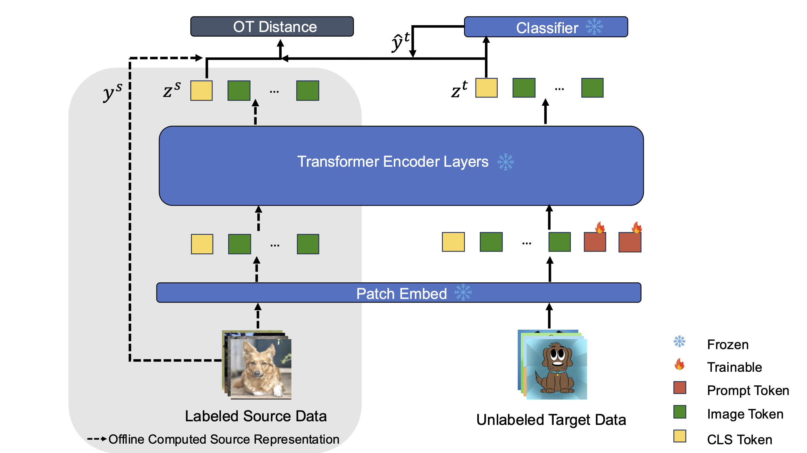

# OT-VP: Optimal Transport-guided Visual Prompting for Test-Time Adaptation
[OT-VP: Optimal Transport-guided Visual Prompting for Test-Time Adaptation](https://arxiv.org/pdf/2407.09498)

Yunbei Zhang, Akshay Mehra, Jihun Hamm

## Overview
Illustration of OT-VP




## Requirements
```bash
pip install -r requirements.txt
```

## ImageNet-C Experiments
We use the ImageNet pre-trained ViT model from ```timm```. ImageNet-C can be downloaded [here](https://zenodo.org/records/2235448#.Yj2RO_co_mF). 
Corruption can be chosen from 0 to 14, corresponding to  ```'gaussian_noise', 'shot_noise', 'impulse_noise', 'defocus_blur', 'glass_blur', 'motion_blur', 'zoom_blur', 'snow', 'frost', 'fog', 'brightness', 'contrast', 'elastic_transform', 'pixelate', 'jpeg_compression'``` respectively.
```bash
python -m domainbed.scripts.adapt --dataset ImageNetC --data_dir [path/to/ImageNet-C] --algorithm OTVP --corruption [0-14]
```

## Citation
Please cite our work if you find it useful.
```bibtex
@article{zhang2024ot,
  title={OT-VP: Optimal Transport-guided Visual Prompting for Test-Time Adaptation},
  author={Zhang, Yunbei and Mehra, Akshay and Hamm, Jihun},
  journal={arXiv preprint arXiv:2407.09498},
  year={2024}
}
```

## Acknowlegdement
[DomainBed](https://github.com/facebookresearch/DomainBed) code is heavily used.
[DoPrompt](https://github.com/zhengzangw/DoPrompt/tree/main?tab=readme-ov-file) is used to implement Visual Prompting.